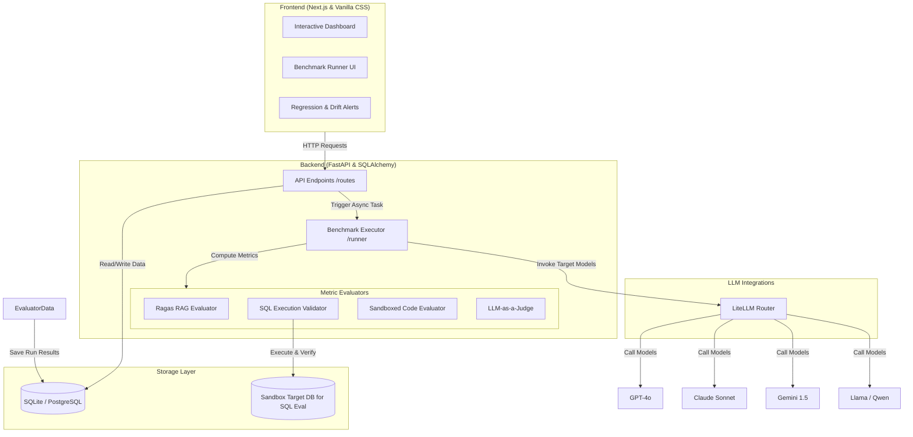

# 🔬 LLM Evaluation & Regression Framework

An enterprise-ready, multi-domain evaluation framework designed to run custom LLM benchmarks, automatically detect performance regressions, monitor semantic drift over time, and visualize results on an interactive dashboard.

## 🚀 Key Features

*   **Unified LLM Client**: Integrated with **LiteLLM** to support calls to OpenAI (GPT-4o), Anthropic (Claude), Google Gemini, and local models (Ollama/Llama/Qwen) with automatic cost tracking and token usage audits.
*   **Multi-Domain Evaluators**:
    *   **RAG**: Assesses *faithfulness* (groundedness) and *answer relevance* (conciseness) with a fallback to customizable LLM judges.
    *   **SQL Generation**: Compiles and executes model queries against an isolated, in-memory **SQLite sandbox** database and performs value-level comparisons against ground truth tables (with strict ordering checks).
    *   **Code Generation**: Verifies Python code syntax using AST parsing and runs functional unit tests within an isolated **subprocess sandbox** equipped with execution timeouts (2-second limits) to protect against infinite loops or thread blocking.
    *   **Summarization & Instructions**: Computes exact match normalization, cosine embedding similarities, and LLM-as-a-judge scores.
*   **Parallel Execution Engine**: Concurrently executes evaluation runs using a thread-safe worker pool connected to SQLite/PostgreSQL.
*   **Analytics, Regression & Drift**: 
    *   Finds performance drop regressions of **$\ge 5\%$** compared to baseline/historical versions.
    *   Monitors and charts average latency, token costs, and individual metric scores over time.
*   **Beautiful Visual Dashboard**: A modern, self-contained glassmorphism dark-themed dashboard served directly from Uvicorn (`http://localhost:8000/dashboard`), plus a matching full-featured **Next.js & TypeScript** web app.

---

## 🏗️ System Architecture



---

## 🛠️ How to Run Locally

### 1. Run the Backend API
1. Navigate to the backend directory:
   ```bash
   cd backend
   ```
2. Activate the virtual environment:
   ```powershell
   # Windows PowerShell
   .\venv\Scripts\Activate.ps1
   ```
3. Set your API credentials in `.env` (or set system environment variables):
   ```bash
   GEMINI_API_KEY="your-gemini-key"
   OPENAI_API_KEY="your-openai-key"
   DATABASE_URL="sqlite:///./llm_eval.db"
   ```
4. Start the FastAPI server using Uvicorn:
   ```bash
   python -m uvicorn app.main:app --reload --port 8000
   ```
   *   The API will be live at `http://localhost:8000` with interactive Swagger docs at `/docs`.
   *   The **built-in interactive visual dashboard** is served at `http://localhost:8000/dashboard`.

### 2. Run the Next.js Dashboard
1. Navigate to the frontend directory:
   ```bash
   cd frontend
   ```
2. Install dependencies:
   ```bash
   npm install
   ```
3. Launch the development server:
   ```bash
   npm run dev
   ```
   *   The dashboard will be active at `http://localhost:3000`.

---

## 🧪 Verification & Running Tests

Run the evaluator unit tests to verify sandboxing timeouts, syntax checking, and evaluation math:
```bash
cd backend
.\venv\Scripts\python.exe test_evaluators.py
```
